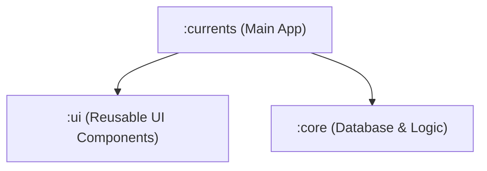

# Currents

Currents is a modern Android productivity application designed to help users organize and track important aspects of their daily digital life. Built using Jetpack Compose and Material 3, the app combines expense management and intelligent link organization into a single streamlined experience.

Users can monitor daily spending through categorized expense tracking and visual insights while also saving and organizing web content with automatic metadata extraction. Currents provides a fast, intuitive interface that makes managing personal information effortless, helping users stay organized, informed, and in control of their daily activities.

## Key Highlights

- **Daily Expense Tracking & Insights**: Monitor and categorize daily spending.
- **Smart Link & Bookmark Management**: Save, tag, and organize web content.
- **Automatic Webpage Metadata Extraction**: Automatically fetch and extract web page summaries and titles.
- **Modern Material 3 Design**: Built completely with Jetpack Compose and standard Material 3 components.
- **Fast & Lightweight**: Designed for responsiveness and optimal performance.

---

## Module Architecture

The application is structured into a multi-module architecture to isolate concerns and promote reusability:

- **`:currents`**: The main application module that orchestrates the app launch, main navigation, and connects the UI components to core database logic.
- **`:ui`**: A dedicated library module containing all reusable Compose UI components, themes, styling, and design system elements.
- **`:core`**: A dedicated library module holding all database configurations, repositories, and data models (strictly non-UI).

---

## License

This project is licensed under the MIT License - see the [LICENSE](LICENSE) file for details.
